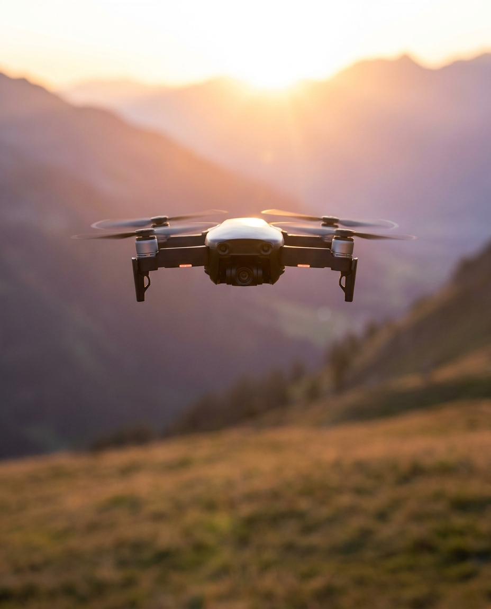

# Тестовый пост: DJI для «ГлобалТехТур»

**Канал:** ГлобалТехТур
**Формат:** пост с картинкой (4:5), текст в подписи
**Статус:** тестовый, к публикации после проверки контактов и цен
**Картинка:** сгенерирована в Higgsfield (Marketing Studio, 4:5, 928×1152) —
`assets/dji-globaltechtour.png`



---

## Вариант А — основной

> 🚁 **DJI: техника, которая снимает за вас**
>
> Дрон перестал быть игрушкой для энтузиастов. Сегодня это рабочий инструмент —
> для съёмки, для осмотра объектов, для контента, который раньше требовал
> вертолёта и бюджета под него.
>
> Что делает DJI стандартом индустрии:
>
> • **Стабилизация.** Трёхосевой подвес держит кадр даже на ветру — картинка
> получается ровной без постобработки.
> • **Умный полёт.** Датчики препятствий, автовозврат домой, слежение за
> объектом. Аппарат не даёт себя разбить.
> • **Складная конструкция.** Помещается в рюкзак — берёте с собой, а не
> «когда-нибудь достану».
> • **Готовый результат.** Съёмка сразу в высоком разрешении, без доводки
> напильником.
>
> Подбираем модель под задачу: съёмка путешествий, коммерческий продакшн,
> инспекция объектов, аэрофотосъёмка для геодезии.
>
> Напишите, какая задача — предложим конфигурацию и посчитаем стоимость 👇
>
> 📍 ГлобалТехТур
> #DJI #дроны #аэросъёмка #ГлобалТехТур

---

## Вариант Б — короткий

> 🚁 **Дрон DJI в рюкзаке — и съёмка уровня продакшена**
>
> Стабилизированный подвес, датчики препятствий, автовозврат. Складывается до
> размера бутылки воды, разворачивается за минуту.
>
> Подберём модель под задачу — от съёмки путешествий до инспекции объектов.
> Напишите нам, что снимаете 👇
>
> 📍 ГлобалТехТур
> #DJI #дроны #аэросъёмка

---

## Перед публикацией проверить

- [ ] Актуальные модели в наличии и их названия
- [ ] Цены, если решите указывать в посте
- [ ] Контакт для заявок (ссылка на менеджера / бот / форма)
- [ ] Правовая формулировка: в РФ дроны тяжелее 150 г подлежат учёту в Росавиации —
      стоит упомянуть, что помогаете с постановкой на учёт, если это так
- [ ] Ссылка на карточку товара в конце поста

## Промпт картинки

Marketing Studio, соотношение 4:5:

```
Premium commercial product photograph of a modern folding quadcopter camera
drone in matte dark grey, hovering in mid-air with propellers spinning and
motion blur, gimbal camera pointed forward. Shot at golden hour above a
dramatic alpine mountain valley with layered ridges and soft haze in the
background, sun flare from the left. Low angle hero shot, shallow depth of
field, crisp detail on the drone body, cinematic color grading, warm highlights
and cool shadows. Clean composition with empty negative space in the lower third
for text overlay. High-end advertising photography, sharp, photorealistic.
No text, no logos, no watermarks.
```

Нижняя треть кадра оставлена пустой намеренно — туда ложится плашка с
логотипом или заголовком, если нужен брендированный вариант.
