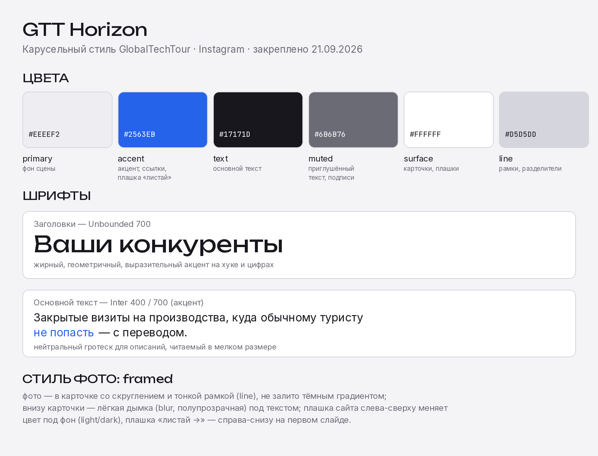

# GTT Horizon — карусельный стиль GlobalTechTour

Закреплённое имя стиля для карусельных постов Instagram бренда GTT.
Утверждено 21.09.2026. Меняется только через явный новый запрос
пользователя — это не черновик, а зафиксированный шаблон.

## Где живёт

- `src/globaltechtour/theme.ts` — `globaltechtourTheme` (цвета, шрифты).
- `src/shared/components/carousel/CarouselSlide.tsx` — ветка `framed`
  (`theme.imageStyle === "framed"`), отдельная от `overlay`-стиля Aura —
  не трогать при правках Aura и наоборот.
- `src/shared/components/carousel/types.ts` — поле `cornerTheme` слайда.
- `data/carousel-style-test-gtt.json` — эталонный тестовый сценарий
  (3 слайда), на нём проверяется любая правка стиля.

## Цвета

| Роль    | Значение  | Назначение                          |
| ------- | --------- | ------------------------------------ |
| primary | `#eeeef2` | фон сцены                            |
| accent  | `#2563eb` | акцент, ссылки, плашка «листай»      |
| text    | `#17171d` | основной текст                       |
| muted   | `#6b6b76` | приглушённый текст, подписи          |
| surface | `#ffffff` | карточки, плашки                     |
| line    | `#d5d5dd` | рамки, разделители                   |

## Шрифты

- Заголовки — **Unbounded 700**.
- Основной текст — **Inter 400**, акцентные слова — **Inter 700** + цвет accent.

## Композиция слайда (`imageStyle: "framed"`)

- Фото — не на весь кадр: лежит в скруглённой карточке-рамке (`line`),
  светлый фон вокруг (`primary`), никакого тёмного градиента поверх фото.
- Верх фото остаётся резким и незамутнённым.
- Внизу карточки — градуированная дымка (`backdrop-filter: blur` +
  `mask-image`), полупрозрачная: силуэт фото должен слегка проглядывать,
  а не тонуть в сплошном тумане.
- Текст лежит поверх дымки, а не отдельным белым блоком под фото.
- Текст описаний/подписей (не заголовок обложки) — `fs(0.05)`, приподнят
  примерно на 1.8 см от базовой позиции (вариант «П3+Р3» из показанных
  пользователю вариантов).
- Заголовок обложки — обычный кегль `coverTitleSize()`, без множителя.
- Акцентные слова в тексте (`**жирный**`) — цвет accent + вес 700, без
  увеличения кегля (увеличение размера пробовали — ломало перенос строк).

## Плашки

- Плашка сайта (`globaltechtour.ru`) — левый верхний угол. Цвет фона/текста
  зависит от `cornerTheme` слайда: `"light"` (по умолчанию) — тёмный текст
  на светлой подложке; `"dark"` — светло-серый текст на тёмной/насыщенной
  подложке (например, синее небо). Ставится вручную на слайд, где фото
  того требует.
- Плашка «листай →» — правый нижний угол, только на первом слайде.
- Счётчик слайдов («3 / 7») — правый верхний угол.

## Фото

- 6–10 фото на карусель.
- Слайд 1 всегда ХУК, дальше — проблема/описание, затем «наша программа».
- Только светлые, дневные сцены — без тёмных кадров. Тёмная вставка — только
  по отдельному согласованию с пользователем.
- Составные фото (два города на одном слайде и т.п.) разрешены.

## Правка стиля

Точечная правка (цвет, кегль, позиция текста) внутри уже согласованного
стиля — делать сразу, без дополнительного подтверждения (см. CLAUDE.md,
п.5). Смена самой концепции (`overlay` вместо `framed`, другая шрифтовая
пара, другая структура карточки) — это новый стиль, а не правка Horizon:
спросить пользователя и, если он согласится, завести его тут отдельным
именем, не переписывая этот файл под новый стиль.
